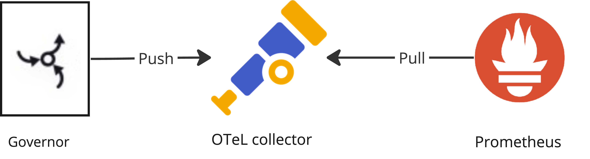

# Synthesized Governor Observability

This guide provides instructions for setting up the observability stack for the Synthesized Governor. The observability stack collects metrics from the Governor and sends them to the Synthesized team for performance analysis.

> **_NOTE:_**  The metrics do not contain any sensitive information related to the database data.

## Table of Contents

- [Overview](#overview)
- [Prerequisites](#prerequisites)
- [Installation](#installation)
    - [Clone the Repository](#clone-the-repository)
    - [Set Up Local Environment](#set-up-local-environment)
    - [Install Opentelemetry Collector](#install-opentelemetry-collector)
    - [Install Prometheus](#install-prometheus)
    - [Update Governor Properties for Exporting Metrics](#update-governor-properties-for-exporting-metrics)
- [Collecting Prometheus Data Snapshot](#collecting-prometheus-data-snapshot)
- [Uninstallation](#uninstallation)

## Overview

The observability stack includes the following components:



## Prerequisites

Ensure the following tools are installed in your development environment:

- [kubectl](https://kubernetes.io/docs/reference/kubectl/overview/)
- [Git](https://git-scm.com/book/en/v2/Getting-Started-Installing-Git)
- [Helm](https://helm.sh/)

The Governor should be installed in your Kubernetes cluster. You can find the installation instructions [here](https://docs.synthesized.io/governor/latest/deployment/helm).

### Clone the Repository

Clone this repository and navigate to the `observability` directory:

```shell
git clone --recursive git@github.com:synthesized-io/helm-charts.git

cd observability
```

## Installation

### Set Up Local Environment

Set up local environment variables. Replace values if needed:

```shell
export NAMESPACE=default
export GOVERNOR_NAME=governor
```

### Install Opentelemetry Collector

Review the values.yaml file and adjust the configuration if needed. Then, add the Helm repo and install the Opentelemetry Collector:

Add Helm repo:
```shell
helm repo add open-telemetry https://open-telemetry.github.io/opentelemetry-helm-charts

helm install --namespace $NAMESPACE otel-collector open-telemetry/opentelemetry-collector -f otel_collector/values.yaml
```

### Install Prometheus

Review the [values.yaml](./prometheus/values.yaml) file and adjust the configuration if needed.Then, add the Helm repo and install Prometheus:

> **_NOTE:_**  The persistent volume claim is created with the default storage class. If you want to use a different storage class, please adjust the `storageClass` value in the `values.yaml` file.

Add Helm repo:
```shell
helm repo add prometheus-community https://prometheus-community.github.io/helm-charts

helm install --namespace $NAMESPACE prometheus-operator prometheus-community/kube-prometheus-stack -f prometheus/values.yaml
```

Expose the service for Prometheus scraping:
```shell
kubectl patch --namespace $NAMESPACE svc otel-collector-opentelemetry-collector -p '{"spec": {"ports": [{"name": "prom-export", "port": 8889, "protocol": "TCP"}]}}'
```

### Update Governor Properties for Exporting Metrics

Update Governor properties for exporting metrics to the Opentelemetry Collector:

> **_NOTE:_**  Governor should be installed in the same namespace as Prometheus and Opentelemetry Collector.

```shell
helm pull oci://synthesizedio.jfrog.io/helm/governor

helm upgrade --namespace $NAMESPACE $GOVERNOR_NAME governor-*.tgz \
--set-string api.container.config.COLLECTOR_OTLP_ENABLED=true \
--set api.container.config.TDK_OBSERVABILITY_FEATURES=metrics \
--set api.container.config.TDK_OBSERVABILITY_ENDPOINT="http://otel-collector-opentelemetry-collector.$NAMESPACE.svc.cluster.local:4317" \
--set api.container.config.TDK_OBSERVABILITY_STEP=5s \
--set api.container.config.LOGGING_LEVEL_IO_OPENTELEMETRY=TRACE
```

## Collecting Prometheus data snapshot

Configure the environment variables:
```shell
export NAMESPACE=default
```

Set up port forwarding to Prometheus (do it in a separate terminal)
```shell
kubectl --namespace $NAMESPACE port-forward service/prometheus-operator-kube-p-prometheus 9090:9090
```

Create a snapshot of Prometheus data:
```shell
curl -XPOST http://localhost:9090/api/v1/admin/tsdb/snapshot
```

The expected result should be similar to:
```json
{"status":"success","data":{"name":"20240516T133116Z-30856130b3c431bc"}}
```

Copy snapshot name from the previous step and set it as a variable:
```shell
export SNAPSHOT_NAME="20240516T133116Z-30856130b3c431bc"
```

Copy name the snapshot to the local machine:
```shell
kubectl --namespace $NAMESPACE cp \
  prometheus-prometheus-operator-kube-p-prometheus-0:/prometheus/snapshots/$SNAPSHOT_NAME \
  -c prometheus ./prometheus_snapshot
```

After that you can archive the folder `prometheus_snapshot` and send the snapshot to the Synthesized team for analysis.

## Uninstallation

### Set up local environment

Set up local environment variables, please replace values if needed:

```shell
export NAMESPACE=default
export GOVERNOR_NAME=governor
```

### Update Governor properties to stop metrics exporting

```shell
helm pull oci://synthesizedio.jfrog.io/helm/governor

helm upgrade -n $NAMESPACE $GOVERNOR_NAME governor-*.tgz \
--set-string api.container.config.COLLECTOR_OTLP_ENABLED=false
```

### Uninstall Prometheus

```shell
helm uninstall --namespace $NAMESPACE prometheus-operator
```

### Uninstall Opentelemetry Collector

```shell
helm uninstall --namespace $NAMESPACE otel-collector
```
